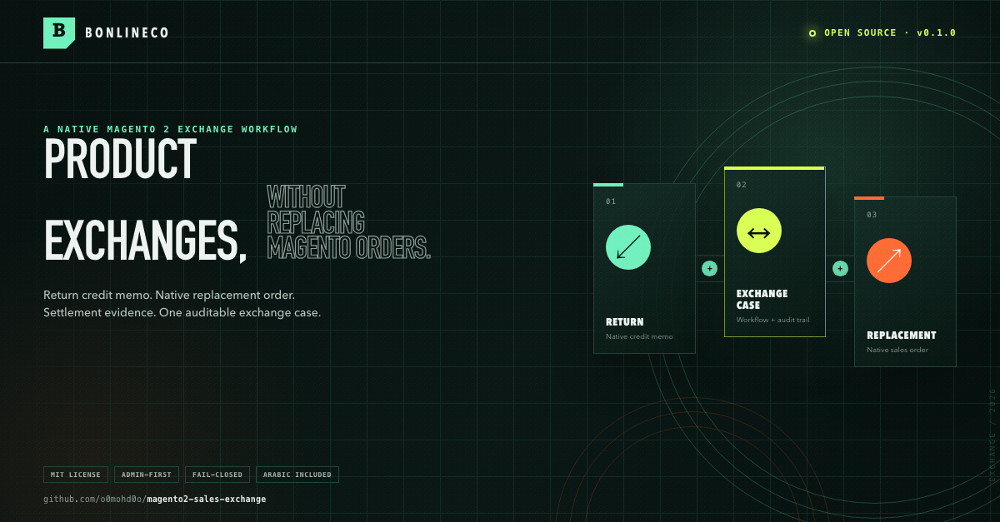

# Bonlineco Sales Exchange

[](https://github.com/o0mohd0o/magento2-sales-exchange/actions/workflows/magento.yml)
[](https://github.com/o0mohd0o/magento2-sales-exchange/actions/workflows/package.yml)
[](LICENSE)

`Bonlineco_SalesExchange` adds an admin-first product-exchange workflow to
Magento Open Source. An exchange is a case that coordinates a return, a native
replacement order, and settlement evidence.

The module does **not** replace Magento's normal order-placement flow and does
not create a second kind of sales order. It never converts or overwrites the
original order. Its credit memo updates Magento's normal refund aggregates;
replacement orders, credit memos, and invoices remain native Magento
documents. The exchange case links them and records the workflow and audit
trail.

> **Release status:** `0.1.3` is the latest pre-1.0 release. The source has
> local unit, static-analysis, and focused isolated Magento 2.4.8 integration
> evidence, plus a hosted compatibility workflow for the four Magento targets
> listed below. Run deployment-specific integration tests before production
> use.



## Features

- **Sales > Exchange Orders** grid and a detailed exchange page.
- Linked-exchange information and a create action on eligible native orders.
- Store-scoped enablement, exchange window, eligible order statuses, and stable
  return-reason configuration.
- Separate exchange, return, replacement, and settlement statuses.
- Canonical, invoice-backed return availability with active-allocation locks.
- Admin-created cases with immutable order, customer, currency, return-credit,
  and replacement-price snapshots.
- Per-line receipt, inspection, condition, disposition, and audit history.
- Offline native credit memos for accepted quantities.
- Recoverable native replacement quote/order creation through Magento's normal
  quote and order services.
- Atomic synchronization of native replacement-order cancellation before
  invoice, shipment, or settlement.
- One full native replacement shipment, immutable shipment proof, and
  idempotent shipment replay.
- A deployment-owned delivery-proof provider and synchronization service;
  Magento core supplies no default delivery proof.
- Full offline native replacement invoice creation during settlement.
- Append-only document links and settlement-ledger entries with stable
  idempotency keys.
- Optimistic versions, deterministic order locking, fixed-scale decimal math,
  layered ACL checks, form-key protected POST actions, and replay validation.
- English source labels and Arabic (`ar_EG`) translations.

## Requirements

- Magento Open Source `2.4.6` through `2.4.9`.
- A PHP version supported by the selected Magento release, within PHP
  `8.1` through `8.5`.
- PHP extension `bcmath`.

The compatibility workflow resolves the supported PHP/service combinations for
these release representatives:

| Magento line | CI target |
| --- | --- |
| 2.4.6 | 2.4.6-p15 |
| 2.4.7 | 2.4.7-p10 |
| 2.4.8 | 2.4.8-p5 |
| 2.4.9 | 2.4.9 |

Patch targets must be refreshed as Magento publishes new security releases.

## Installation

Test installation on a staging environment and back up the database before
installing a module that adds declarative schema.

### Composer

After the package is published:

```bash
composer require bonlineco/module-sales-exchange
bin/magento module:enable Bonlineco_SalesExchange
bin/magento setup:upgrade
bin/magento setup:db:status
bin/magento cache:flush
```

For development before publication, use a Composer path repository:

```bash
composer config repositories.bonlineco-sales-exchange path \
  /absolute/path/to/module
composer require bonlineco/module-sales-exchange:@dev
```

### `app/code`

Copy the package contents to `app/code/Bonlineco/SalesExchange`, then run:

```bash
bin/magento module:enable Bonlineco_SalesExchange
bin/magento setup:upgrade
bin/magento setup:db:status
bin/magento cache:flush
```

Use the normal production deployment procedure for DI compilation and static
content deployment.

## Configuration

Open **Stores > Configuration > Sales > Sales Exchanges**.

| Setting | Default | Purpose |
| --- | --- | --- |
| Enable Sales Exchanges | No | Hides new exchange actions when disabled; existing cases stay readable. |
| Exchange Window (Days) | 30 | Maximum age of the original order at case creation. |
| Eligible Order Statuses | `complete` | Original order statuses allowed to begin an exchange; custom delivered statuses can be selected per store. |
| Allowed Return Reasons | Six built-in codes | Store-scoped reasons available to administrators. |

Configuration and create-form values are previews. The command layer reloads
the order and locks the authoritative rows before it writes an allocation or
native document.

### ACL

Grant custom resources explicitly to existing admin roles; Magento does not
automatically grant newly installed ACL resources.

| Action | Required custom resource | Additional native permission |
| --- | --- | --- |
| Read cases | `Bonlineco_SalesExchange::view` | Sales order view |
| Create case | `Bonlineco_SalesExchange::create` | Sales order view |
| Approve/authorize/start | `Bonlineco_SalesExchange::approve` | Sales order view |
| Receive/inspect | `Bonlineco_SalesExchange::warehouse` | Sales order view |
| Reject/cancel | `Bonlineco_SalesExchange::cancel` | Sales order view |
| Cancel unplaced replacement | `Bonlineco_SalesExchange::replacement_cancel` | Sales order view |
| Create return credit memo | `Bonlineco_SalesExchange::financial` | `Magento_Sales::creditmemo` |
| Create replacement order | `Bonlineco_SalesExchange::replacement_order` | `Magento_Sales::create` |
| Reconcile settlement | `Bonlineco_SalesExchange::settlement` | `Magento_Sales::invoice` |

Every action also requires exchange-read access. The settlement action always
requires native invoice permission, including refund-only replay, because the
controller must not make authorization decisions from request-supplied state.

## Admin workflow

1. Use **Sales > Operations > Exchange Orders > Create Exchange** and load
   the original order, or open an eligible native sales order and choose
   **Create Exchange** there.
2. Select return quantities and reasons, then add enabled simple-product
   replacement SKUs.
3. Create and approve the draft, authorize the return, and start the case.
4. Resolve the received quantity for every return line, including explicit
   zero-received lines.
5. Record accepted and rejected quantities, condition, and disposition.
   Finalization derives `accepted`, `partially_accepted`, or `rejected` from
   persisted lines.
6. For an accepted or partially accepted return, create the offline credit
   memo. Accepted quantities must already be invoiced and unrefunded.
7. Create or resume the replacement order. The command uses an isolated quote,
   places a native Magento order, and reconciles immutable case/intent/line
   markers. A retry recovers the same intent instead of creating a second
   order.
8. Before invoice, shipment, or settlement, the replacement can be cancelled
   through Magento's native order-cancellation service. The same transaction
   clears the active replacement projection while retaining its immutable
   order link as audit evidence. A cancelled replacement uses refund-only
   settlement.
9. For an active replacement, create one full native shipment through
   Magento's shipment service with native notification disabled. Partial
   shipments fail closed. The module appends one immutable shipment link and
   advances `ordered` to `shipped`; an exact retry returns that shipment
   without emitting a duplicate event.
10. Complete any external customer payment or merchant refund outside this
   module and keep its trusted reference.
11. Reconcile settlement. For an active replacement, the command creates or
   verifies one exact full offline native invoice, validates native return
   credit, and appends the canonical succeeded ledger rows. A cancelled
   replacement follows a refund-only path without an invoice.
12. Configure a deployment delivery-proof adapter. After the authoritative
    courier/order-tracking record is durable, call
    `SynchronizeReplacementDeliveryInterface::execute($replacementOrderId)`.
    The command obtains proof from the configured provider, revalidates the
    full native shipment, advances `shipped` to `delivered`, and supports an
    exact immutable replay.
13. An active-replacement exchange completes automatically only when its
    return, delivered-replacement, and settlement invariants permit completion.
    A cancelled replacement can instead complete through the refund-only
    settlement path without delivery.

If a receipt or inspection action is interrupted after its rows persist, use
the corresponding recovery/finalization action. A stale case or line version
must be reloaded before retrying.

## Quantities and balance

Return availability is based on the native invoice and refund history:

```text
qty_invoiced - canonical qty_refunded - active exchange allocation
```

Simple items and the visible parent of a configurable product are supported as
return lines. Configurable generated children are mapped to their visible
parent so one physical sale cannot be allocated twice.

The exchange balance is:

```text
effective replacement charge + fee amount - effective return credit
```

A positive balance means the customer owes money; a negative balance means the
merchant owes a refund. Values are decimal strings at four decimal places.

The replacement charge is status-authoritative:

```text
pending                         = 0
ready                           = approved merchandise + approved shipping
ordered / shipped / delivered  = native replacement order total
cancelled                       = 0
```

Before native return execution, accepted-but-uncredited quantity uses the
immutable estimate. Afterwards it uses:

```text
cumulative native actual + estimate for accepted-but-uncredited quantity
```

After all accepted quantity is credited, native actual is authoritative. Each
document link retains both expected and actual values so Magento rounding
remains visible instead of rewriting the approval snapshot.

## Native-document and settlement safety

The credit-memo command acquires Magento's sales-order mutex, reloads the order,
locks allocation rows, builds explicit DTO quantities, and compares the saved
credit memo with its canonical preview. It rejects shipping refunds, manual
adjustments, unrelated or duplicate lines, inventory-disposition drift, and
unrepresented totals. Only the exact request-scoped operation marker can bypass
its own active return reservation.

Replacement creation records unique exchange and intent markers on the quote
and order, plus stable replacement-line markers on quote and order items. A
durable prepared quote can be resumed after interruption. Native Magento order
and inventory behavior remains authoritative.

Native replacement cancellation is intercepted at
`Magento\Sales\Model\Service\OrderService::cancel`. For a marked order, the
command locks the original order and replacement order in that order, reloads
the complete aggregate, validates the immutable order proof, and contains
Magento's cancellation plus the exchange compensation in one sales
transaction. An invoiced, shipped, partially cancelled, or refunded
replacement fails closed.

Native replacement shipment is intercepted at
`Magento\Sales\Model\ShipOrder::execute`. Only a full shipment is accepted.
The command uses the same deterministic lock order, revalidates the marked
order before the native write, reloads the saved shipment, and appends its
immutable fingerprint before commit. Native shipment notification is rejected
for marked replacement orders; notification adapters should consume the
post-commit exchange event. Exact retries validate and return the existing
shipment without a second write.

Settlement uses these canonical entries:

- `return_credit` for the validated native return-credit amount;
- `customer_payment` when the final balance is positive; or
- `merchant_refund` when the final balance is negative.

The module does **not** capture a payment or send a gateway refund. For either
cash direction, the administrator must provide a trusted external reference;
the command records it as succeeded evidence. A zero balance rejects an
external cash reference. Exchange fees are intentionally unsupported in this
release.

The replacement invoice is an offline, non-capturing, non-notifying full
invoice. Partial replacement invoices, existing unrelated invoices, modified
native totals, or a missing immutable order link fail closed.

After committed changes the module dispatches:

- `bonlineco_sales_exchange_creditmemo_created`;
- `bonlineco_sales_exchange_replacement_order_created`;
- `bonlineco_sales_exchange_replacement_order_cancelled`;
- `bonlineco_sales_exchange_replacement_order_shipped`;
- `bonlineco_sales_exchange_replacement_order_delivered`; and
- `bonlineco_sales_exchange_settlement_reconciled`.

Post-commit event delivery is best-effort; there is no durable outbox.
Database rollback cannot undo network calls made synchronously by third-party
sales observers. Email, ERP, analytics, payment, and webhook integrations must
defer external effects until a post-commit event or use a transactional outbox.

### Delivery and deployment adapters

The open-source module deliberately does not map custom courier or order
statuses. Its default `ReplacementDeliveryProofProviderInterface` returns no
proof, so delivery synchronization fails closed. A deployment adapter must:

1. implement `ReplacementDeliveryProofProviderInterface`;
2. return a stable proof reference only for its authoritative delivered state;
3. call `SynchronizeReplacementDeliveryInterface` after that source record is
   durable; and
4. retry the command when delivery synchronization is interrupted.

The caller supplies only the replacement order ID. It cannot supply a target
status or proof string. The command obtains and validates proof through the
configured provider and binds the first accepted proof into append-only audit
history.

Deployment-specific notification, analytics, ERP, and courier bridges should
observe the module's post-commit events. They must not add private-module
dependencies to `Bonlineco_SalesExchange`.

## Limitations

- Admin-only workflow; no customer self-service.
- Replacement selection supports enabled simple products only; configurable
  option selection, bundles, and other composite replacements are unsupported.
- Replacement uses the original order addresses and currencies.
- Replacement shipping and exchange fee are zero in the first release.
- Payment collection and merchant refunds are external; the module records
  their reference but does not call a gateway.
- Credit-memo execution is offline and does not create a missing original
  invoice.
- WEEE/FPT and third-party refundable totals are fail-closed when they produce
  a residual outside the supported subtotal, discount, tax, and
  discount-tax-compensation structure.
- Replacement-order fees, WEEE/FPT, discounts, charged shipping, or other
  totals outside merchandise plus tax fail closed instead of being silently
  omitted.
- Native refunds of a marked replacement order fail closed at Magento's
  `RefundAdapter` boundary. Third-party payment-fee or online-refund adapters
  are therefore not invoked for that unsupported operation; the original
  return credit memo still requires deployment-specific compatibility tests.
- Partial replacement shipments, native shipment email, courier integration,
  notifications, and a durable integration outbox are not included.
- Direct order cancellation/save, direct shipment repository writes, direct
  database writes, and custom refund implementations that bypass
  `OrderService`, `ShipOrder`, or `RefundAdapter` are outside the supported
  mutation boundary.
- Atomic behavior with split sales/module database connections and synchronous
  third-party observers requires deployment-specific proof.

## Testing and release evidence

From a Magento root containing the module:

```bash
composer validate --strict --no-check-version \
  app/code/Bonlineco/SalesExchange/composer.json

vendor/bin/phpcs \
  --standard=Magento2 \
  --extensions=php,phtml \
  --error-severity=10 \
  --warning-severity=0 \
  --ignore-annotations \
  app/code/Bonlineco/SalesExchange

vendor/bin/phpunit \
  --no-extensions \
  -c dev/tests/unit/phpunit.xml.dist \
  app/code/Bonlineco/SalesExchange/Test/Unit

vendor/bin/phpunit \
  -c dev/tests/integration/phpunit.xml.dist \
  app/code/Bonlineco/SalesExchange/Test/Integration

vendor/bin/mftf generate:tests AdminSalesExchangeGridSmokeTest \
  AdminSalesExchangeAclTest AdminSalesExchangePostOnlyTest --force
vendor/bin/mftf run:group bonlineco_sales_exchange

php app/code/Bonlineco/SalesExchange/dev/ci/check-data-provider-metadata.php
php app/code/Bonlineco/SalesExchange/dev/ci/check-package-metadata.php
```

Repository CI defines PHP 8.1-8.5 syntax gates, Composer/archive validation,
XML, JSON, JavaScript, secret-history scanning, Magento-version-specific unit
and integration tests, Magento coding standard, and DI compilation.

At this source state, local evidence comprises 337 passing unit tests on each
of PHPUnit 9.6, 10.5, and 12.5; module PHP lint and Magento coding-standard
checks; six focused Magento Open Source 2.4.8 integration tests with 29
assertions, including a real nested `OrderMutexInterface` rollback; and a clean
isolated DI compilation after the latest shipment-validator constructor
wiring. The MFTF Data/Test definitions validate against their schemas, the
Page/Section files are well-formed, and all three tests generate to Cests;
browser execution is not claimed. These results do not substitute for the
standalone repository's full Magento matrix. PHPUnit data providers carry both
the PHPUnit 9 annotation and PHPUnit 10/12 attribute.

Before a production or Marketplace release, the remaining mandatory evidence
is fresh archive installation/upgrade, full native-document rollback and
replay, database concurrency, MFTF browser execution, MSI and legacy inventory
modes, supported currency and rounding configurations, split-database
behavior, and representative third-party observer behavior on every claimed
Magento line.

## Contributing, security, and license

- See [CONTRIBUTING.md](CONTRIBUTING.md) for the development and test policy.
- Report vulnerabilities according to [SECURITY.md](SECURITY.md).
- Release notes are in [CHANGELOG.md](CHANGELOG.md).
- Licensed under the [MIT License](LICENSE).
